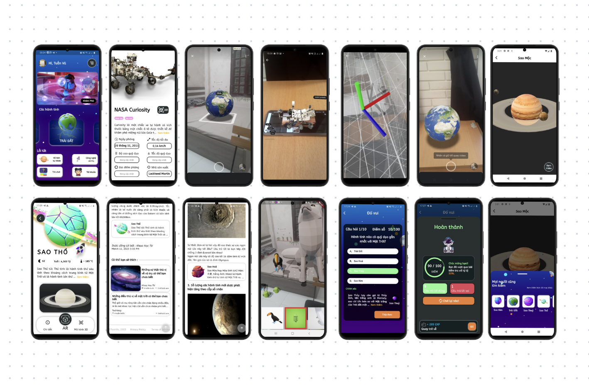
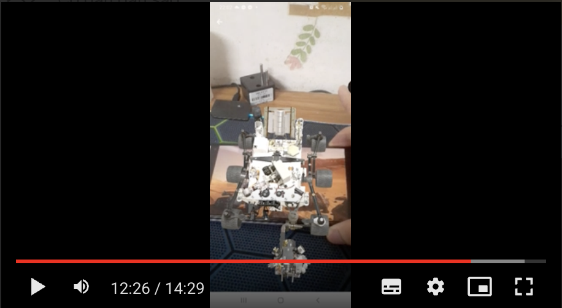

# SPACE EXPLORATION

**SPACE EXPLORATION** is an augmented reality (AR) educational app developed using Flutter/Dart. Designed for children, it provides an interactive learning experience about the Solar System through 3D planetary models and AR technology.

## Features

- Explore the Solar System with detailed 3D models of planets.
- Use your phone's camera to display planets in the real world using AR.
- Stay updated with the latest space news.
- Participate in fun quiz games to test your space knowledge.
- Beautiful, user-friendly interface designed for young learners.

## Demo

Click the image above to watch the demo.

## Getting Started

This project was developed with Flutter, making it cross-platform ready, though it is currently available only on Android.

### Resources

A few resources to help you get started with Flutter development:

- [Lab: Write your first Flutter app](https://docs.flutter.dev/get-started/codelab)
- [Cookbook: Useful Flutter samples](https://docs.flutter.dev/cookbook)

For further guidance, visit the official [Flutter documentation](https://docs.flutter.dev/), which provides tutorials, samples, and a full API reference.
